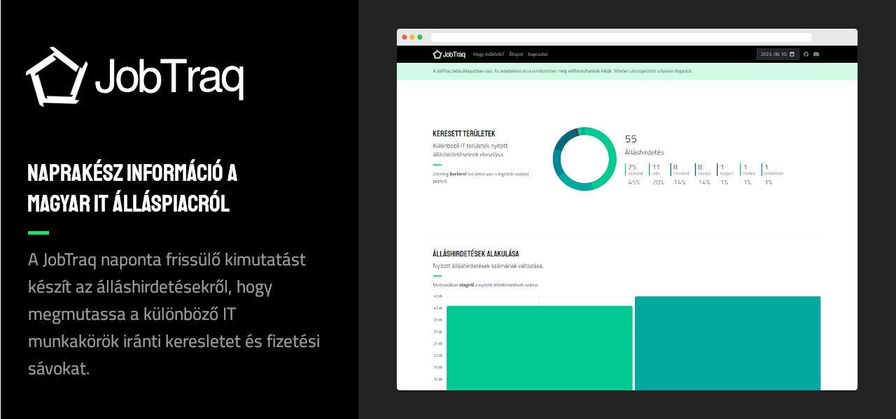

A JobTraq naponta frissülő kimutatást készít az álláshirdetésekről, hogy megmutassa a különböző IT munkakörök iránti keresletet és fizetési sávokat.

Segítségével látható

- a különböző munkakörök közötti fizetési különbségek,
- különböző szintek szerinti fizetések (junior, senior, lead, stb.)
- stackek iránti kereslet
- és még sok minden más.

Web: https://jobtraq.hu 
Teszt verzió: https://test.jobtraq.hu 
API dokumentáció: https://apidoc.jobtraq.hu

## Technikai

A frontend Angular, a backend pedig Laravel.

### Frontend

A frontend oldal néhány API kéréssel dolgozik csak, minden kimutatást a backend állít össze. Ezeket egyszerű
chartokkal jeleníti meg.

[Frontend információk](angular-frontend/README.md)

### Backend

A backend tartalmaz egy egyszerű admin felületet, ahol beállíthatóak a scraperek és a különböző keresési feltételek,
illetve minden olyan adat, amiből a kimutatások össze vannak állítva és az álláshirdetések be vannak kategorizálva.

A backend rész végzi a scrapelést, a kimutatások összeállítását, stb.

[Backend információk](laravel-backend/README.md)

A backend rész tartalmaz teszteket is, amit az `artisan test` paranccsal tudsz futtatni.

### E2E tesztelés

A `cypress-tests` mappában [Cypress](https://www.cypress.io/) tesztek találhatóak. Ezek E2E tesztek, futtathatóak, ha
- a frontend alkalmazás fut,
- a backend alkalmazás fut és a `php artisan migrate --seed` futtatva volt,
- a backend oldalon lettek scrapelve álláshirdetések (`php artisan jtq:scrape`)

[E2E teszt részletek](cypress-tests/README.md)

### Deploy

A deployhoz [Deployer](https://deployer.org/) lett beállítva a projektbe.

[Deploy részletek](deploy/README.md)
